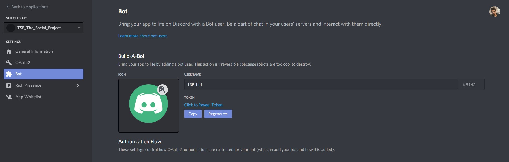
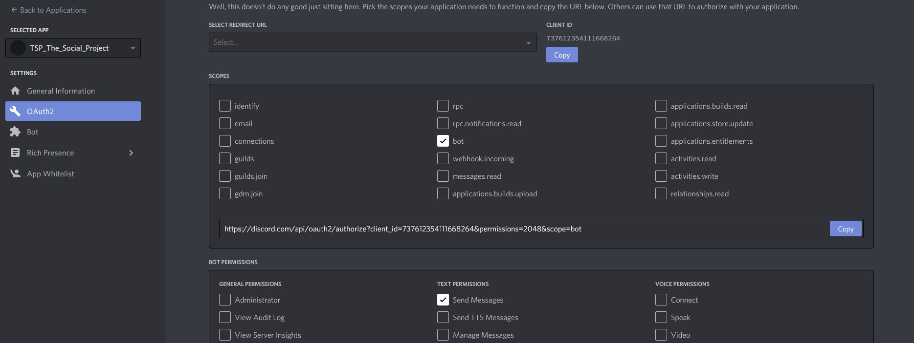
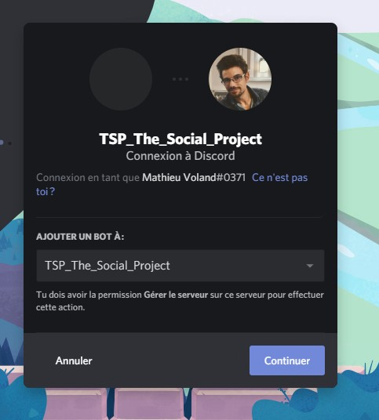

# Création d'un bot discord

## Présentation

Mini-tutoriel sur la création d'un bot sur Discord avec la [gem discordrb](https://github.com/discordrb/discordrb). La première partie de ce tutoriel est largement inspiré de [cet article sur Medium](https://medium.com/@goodatsports/how-to-make-a-simple-discord-bot-in-ruby-to-annoy-your-friends-f5d0438daa70).


## 1. Ping! Pong! bot

### 1.1. Création du bot

Ca se passe ici : [https://discordapp.com/developers](https://discordapp.com/developers) (utiliser le QR avec l'app sur le téléphone, ou bien entrer les login / password). Il faut ensuite créer une application en lui donnant un nom, puis un bot et lui donner un nom.

<p align="center">  </p>

Une fois le bot créé il faut lui permettre de rejoindre un serveur (où vous devez être administrateur). Pour cela il faut utiliser l'onglet OAuth2, cocher la case "bot" puis les permissions souhaités pour le bot. Cela créé un lien à copier et ouvrir dans le navigateur pour ajouter notre bot à un serveur.

<p align="center">


</p>

Normalement Discord notifie d'un petit message confirmant que le bot a bien rejoint le serveur.

### 1.2. Utiliser la gem discordrb

La première étape est de récupérer nos clés de l'API pour les mettre dans un joli `.env` qu'on ajoute tout de suite au `.gitignore`. Le client id est à récupérer sur l'onglet "General Information", il apparait en clair. Le bot token est à récupérer sur l'onglet "Bot", il faut cliquer pour le révéler.

```
DISCORD_CLIENT_ID = <copier ici le client id - un numéro entier>
DISCORD_BOT_TOKEN = "<copier ici le token - chaîne de caractères>"
```

Voilà tout est prêt pour utiliser notre bot. Notre première application va simplement lire tous les messages envoyés directement au bot, et chaque fois qu'on lui envoie "Ping!" il va répondre "Pong!".

```ruby
# Bundler
require 'bundler'
Bundler.require

require 'discordrb'
require 'dotenv/load'
$:.unshift File.expand_path('lib', __dir__)

# Main method of the script
def perform
  bot = Discordrb::Bot.new token: ENV['DISCORD_BOT_TOKEN'], client_id: ENV['DISCORD_CLIENT_ID']

  bot.message(with_text: 'Ping!') do |event|
    event.respond 'Pong!'
  end

  bot.run
end

# Only if the file is being executed directly, as a script
perform if __FILE__ == $0
```

<p align="center">  </p>

TIPS! Discord > Settings > Appearance > Developer Mode : permet de récupérer les channel ID par exemple avec un clic droit.


## 2. Faire travailler le CommandBot !

### 2.1 Commande bonjour

Pour pouvoir faire plus de choses avec notre bot on change la définition avec : 

```ruby
bot = Discordrb::Commands::CommandBot.new token: ENV['DISCORD_BOT_TOKEN'], client_id: ENV['DISCORD_CLIENT_ID'], prefix: '$', advanced_functionality: true
```

L'option `prefix` déinit le préfixe qui sera utilisé pour pouvoir commander notre bot. Par exemple pour avoir un bot qui répond à une commande du type `$hi` (soit en message privé au bot, soit sur tout channel auquel il a accès) on peut définit la méthode suivante :

```ruby
bot.command :hi do |event|
  event.respond "Hi #{event.user.username}"
end
```

#### Astuce

Il est pratique de faire tourner le bot de manière asynchrone. Le `at_exit` garantit qu'il informera Discord avant de disparaitre, dans le cas contraire il pourra apparaitre en ligne quelques minutes après sa destruction à la fin du programme (si le programme se termine avant le `join`).

```ruby
at_exit { bot.stop }
bot.run :async

# Code nécessitant que le bot soit opérationnel :)

bot.join
```

### 2.2 Accéder aux utilisateur et channels

Voir l'exemple `command_th_bot.rb` pour des exemples sur la manière de retrouver tous les channels et les users, ce qui nous permettra de discuter avec eux.

```ruby
# All servers and channels bot has access to
bot.servers.each do |id, server|
  server.channels.each do |channel|
    puts "CHANNEL: #{channel.inspect}"
  end
end

# All users bot share a server with
bot.users.each do |id, user|
  puts "USER id=#{id} -> #{user.inspect}"
end
```

### 2.3 Envoyer des messages


